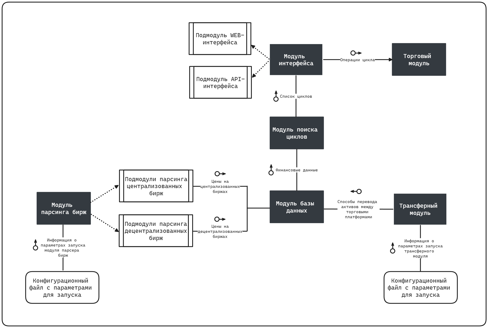

# Arbitrage-unit который смог

Система исследует централизованные и децентрализованные криптобиржи на предмет наличия возможности арбитража и выдает список самых прибыльных арбитражных циклов для перемещения криптовалюты.

- Модуль `arbitrageur` осуществляет поиск прибыльных торговых цепочек на основании собранных финансовых данных
- Модуль `initializer` заполняет базу данных информацией, необходимой для однозначной идентификации монет
- Модуль `scanner` извлекает актуальную рыночную информацию и помещает в модуль базы данных
- В модуле `database` хранятся все финансовые данные, необходимые для функционирования системы

____

<h4 align="center">
  
</h4>
